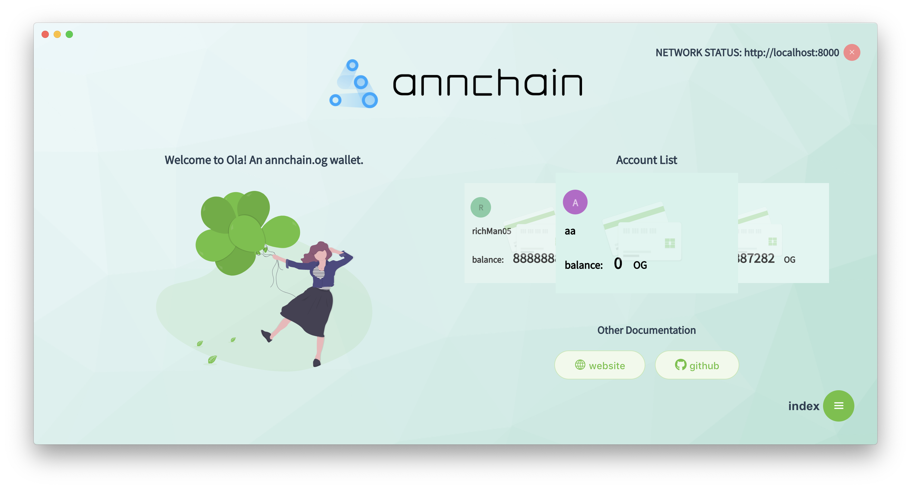
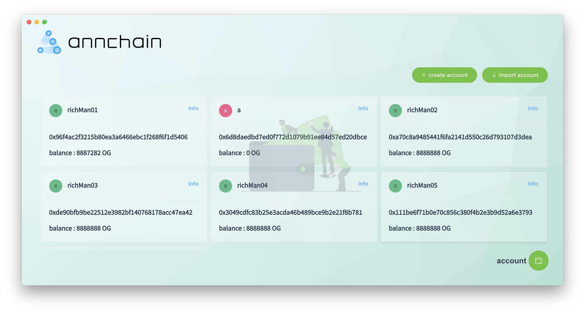

# og-wallet

> An electron-vue project




> stack : node.js + electron + vue + sqlite + og-sdk

#### Build Setup

``` bash
# install dependencies
npm install

# serve with hot reload at localhost:9080
npm run dev

# build electron application for production
npm run build


# lint all JS/Vue component files in `src/`
npm run lint

```

---

# og-wallet

[download](https://github.com/annchain/OGWallet/releases/tag/v0.1.2)

[mac](https://github.com/annchain/OGWallet/releases/download/v0.1.2/OG-wallet-v0.1.2-darwin-x64.zip)

[linux](https://github.com/annchain/OGWallet/releases/download/v0.1.2/OG-wallet-v0.1.2-linux-x64.zip)

[windows](https://github.com/annchain/OGWallet/releases/download/v0.1.2/OG-wallet-v0.1.2-win32-x64.zip)